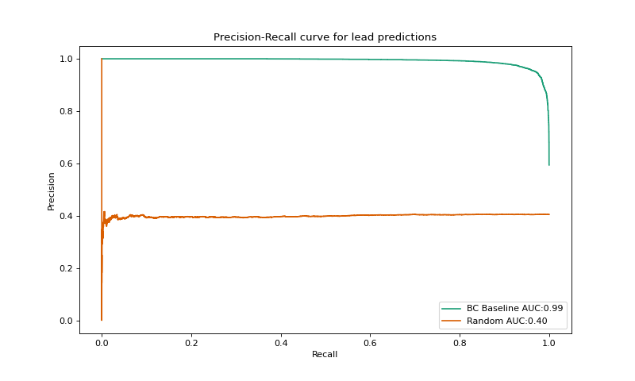

# teamBlueConduit
capstone project for Harvard IACS AC297r

# Libraries setup

```pip install .```

## Build datasets
```build_datasets(data_raw_path, save_dir=None, n_splits=3, train_size=.75, random_state=42)```

**Example**

```
from blue_conduit_spatial.utilities import build_datasets
save_dir = f'data/test_dir'  
Xtrain, Xtest, Ytrain, Ytest = build_datasets(data_raw_path, save_dir=save_dir)
```
## Load datasets

**Example**

```
from blue_conduit_spatial.utilities import load_datasets
load_dir = f'data/test_dir'  
Xtrain, Xtest, Ytrain, Ytest = load_datasets(load_dir)
```

## Plot precision-recall curve

```
import numpy as np
import pandas as pd

from blue_conduit_spatial.evaluation import plot_pr_curve

data_dir = '../data'
y_train_path = f'{data_dir}/processed/Ytrain.csv'
bc_yhat_train_path = f'{data_dir}/processed/predictions/jared_train_yhat.csv'

y_train = pd.read_csv(y_train_path)['dangerous'].values
y_hat_train = pd.read_csv(bc_yhat_train_path).values[:,1]
y_hat_random = [np.random.rand(len(y_train))]

mod_list = [y_hat_train, y_hat_random]
labels = ['BC Baseline', 'Random']

plot_pr_curve(y_train, mod_list, labels=labels)
```




