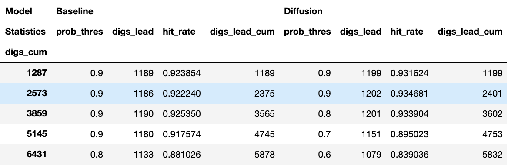
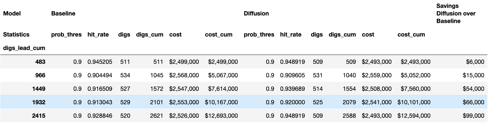

# Evaluation

## Generate hit rate curve

There are two primary methods for generating the hit-rate curve, and a single plotting utility for doing so. The functions live in [blue_conduit_spatial.evaluation](blue_conduit_spatial/evaluation). First, `generate_hit_rate_curve` will create a hit rate curve ordering by the prediction probability. If generating the hit rate curve by partition (i.e. group by the partition and then investigate partitions with more expected lead first), this can be done by `generate_hit_rate_curve_by_partition`. These are equivalent when `threshold_init=1.0`, `threshold_increment=1e-6` (or some other arb. small number), and `min_digs=0`. That will visit partitions exactly in the order of the highest probability (though will be substantially slower).

### Sample usage:

```python3
from blue_conduit_spatial.utilities import load_datasets, load_predictions, select_data
from blue_conduit_spatial.evaluation import generate_hit_rate_curve, generate_hit_rate_curve_by_partition, plot_hit_rate_curve, dig_stats, dig_savings

data_dir = '../data'
load_dir = f'{data_dir}/Processed'
pred_dir = f'{data_dir}/Predictions'
pid_lat_lon_path = f'{load_dir}/pid.gpkg'

# Load data for all hexagons resolutions, train sizes and splits
Xdata, Ydata, location, train_pid, test_pid, partitions_builder = load_datasets(load_dir)
train_pred_all_bl, test_pred_all_bl = load_predictions(pred_dir, probs_prefix='baseline')
train_pred_all_diff, test_pred_all_diff = load_predictions(pred_dir, probs_prefix='diffusion')

# Filter the data for one selection of hyperparameters (hexagons resolutions, train sizes and splits)
n_hexagons = 47
train_size = 0.1
split = 0

args = {    
    'Xdata': Xdata,
    'Ydata': Ydata,
    'location': location,
    'train_pid': train_idx,
    'test_pid': test_idx,
    'train_size': train_size,
    'split': split,
    'return_pid': False,
    'generate_hexagons': False
}

# Data selection arguments
args_bl, args_diff = args.copy(), args.copy()

# Set data selection arguments for Baseline model
args_bl['train_pred_all'] = train_pred_all_bl
args_bl['test_pred_all'] = test_pred_all_bl

# Set data selection arguments for Diffusion model
args_diff['train_pred_all'] = train_pred_all_diff
args_diff['test_pred_all'] = test_pred_all_diff

# Select data per model
data_bl = select_data(**args_bl)
data_diff = select_data(**args_diff)

# Get city map hexagons
hexagons = partitions_builder.Partition(partition_type='hexagon', num_cells_across=n_hexagons)
parcel_gdf = hexagons.parcel_gdf

test_index = data_bl['test_index']
y_test = data_bl['Ytest']

plot_args = {
    'plot_probs': False,
    'labels':['BlueConduit Baseline', 'Random Beta(1,1)'],
    'mode':'all',
    'y_true': y_test,
    'y_pred': [data_bl['test_pred'], np.random.beta(1, 1, size=len(y_test))],
    'title_suffix': 'Test set'
}

plot_hit_rate_curve(**plot_args)
```


### Comparison between HRC methods

In the plot below, we demonstrate the differences in performance for the Blue Conduit baseline, for a single split / resolution / set of hyperparameters. Note that most splits / resolutions show qualitatively similar results. Increasing initial threshold improves performance over initial homes. Decreasing increment has similar parameter. Decreasing minimum num. homes improves relative performance over second half of homes.


## Generate digging statistics table

**```dig_stats(parcel_gdf, index_list, y_true, y_pred, strat_names=None, bins=15, mode='digs_lead_number', hr_args=None)```**

```
Returns
---------------------
  dig_stats_df: pd.DataFrame
```

Calculate digging statistics for each digging strategy within `y_pred` based on `mode` criteria.
Bins the data for improving the insights, following the digging order imposed by the hit rate curve
ordered by partition.

Modes:

* `digs_number`: parcels are binned in batches with equal number of diggings.
* `digs_lead_number`: parcels are binned in batches with equal number of lead diggings.

**```dig_savings(dig_stats_df, model1_str, model2_str)```**

Meant to be used when `dig_stats` is in `mode=digs_lead_number`. Comparison of lead pipe replacement cost between
`model1_str` and `model2_str` which should correspond to names in the `strat_names` passed to `dig_stats`.
Generates a new column in the `dig_stats_df` with the cost savings segmented every `N` replaced pipes.

```
Returns
---------------------
  dig_stats_df: pd.DataFrame
```

### Sample usage

```
# Set `dig_stats` arguments
parcel_gdf = parcel_gdf
index_list = data_bl['test_index']
y_true = data_bl['Ytest']
y_pred = [data_bl['test_pred'], data_diff['test_pred']]
strat_names = ['Baseline', 'Diffusion']
bins = 15

# Get digging statistics
mode = 'digs_number'
dig_stats_df = dig_stats(parcel_gdf, index_list, y_true, y_pred, strat_names=strat_names, bins=bins, mode=mode)
dig_stats_df
```



```
mode = 'digs_lead_number'
dig_stats_df = dig_stats(parcel_gdf, index_list, y_true, y_pred, strat_names=strat_names, bins=bins, mode=mode)
dig_stats_df = dig_savings(dig_stats_df, 'Baseline', 'Diffusion')
dig_stats_df.head()
```

