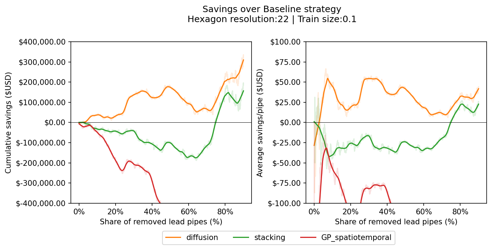
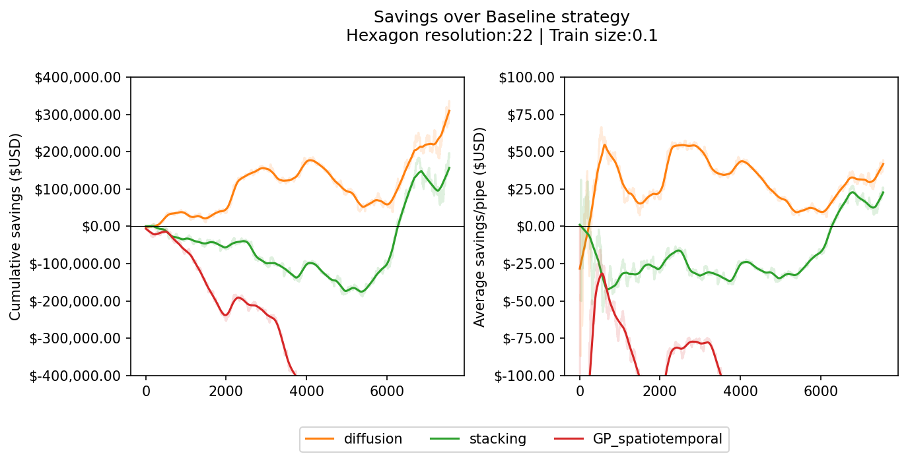

# Evaluation

### Table of Contents
- [Hit Rate Curve](##Generating-Hit-Rate-Curves)
- [Dig Table Statistics](#Generating-digging-statistics-table)
- [API Reference](#API-Reference)


## Generating Hit Rate Curves

There are two primary methods for generating the hit-rate curve, and a single plotting utility for doing so. The functions live in [blue_conduit_spatial.evaluation](../../blue_conduit_spatial/evaluation). First, `generate_hit_rate_curve` will create a hit rate curve ordering by the prediction probability. If generating the hit rate curve by partition (i.e. group by the partition and then investigate partitions with more expected lead first), this can be done by `generate_hit_rate_curve_by_partition`. These are equivalent when `threshold_init=1.0`, `threshold_increment=1e-6` (or some other arb. small number), and `min_digs=0`. That will visit partitions exactly in the order of the highest probability (though will be substantially slower).

### Sample usage:

```python3
from blue_conduit_spatial.utilities import load_datasets, load_predictions, select_data
from blue_conduit_spatial.evaluation import generate_hit_rate_curve, generate_hit_rate_curve_by_partition, plot_hit_rate_curve, dig_stats, dig_savings

data_dir = '../data'
load_dir = f'{data_dir}/Processed'
pred_dir = f'{data_dir}/Predictions'
pid_lat_lon_path = f'{load_dir}/pid.gpkg'

# Load data for all hexagons resolutions, train sizes and splits
Xdata, Ydata, location, train_pid, test_pid, partitions_builder = load_datasets(load_dir)
train_pred_all_bl, test_pred_all_bl = load_predictions(pred_dir, probs_prefix='baseline')
train_pred_all_diff, test_pred_all_diff = load_predictions(pred_dir, probs_prefix='diffusion')

# Filter the data for one selection of hyperparameters (hexagons resolutions, train sizes and splits)
n_hexagons = 47
train_size = 0.1
split = 0

args = {    
    'Xdata': Xdata,
    'Ydata': Ydata,
    'location': location,
    'train_pid': train_idx,
    'test_pid': test_idx,
    'train_size': train_size,
    'split': split,
    'return_pid': False,
    'generate_hexagons': False
}

# Data selection arguments
args_bl, args_diff = args.copy(), args.copy()

# Set data selection arguments for Baseline model
args_bl['train_pred_all'] = train_pred_all_bl
args_bl['test_pred_all'] = test_pred_all_bl

# Set data selection arguments for Diffusion model
args_diff['train_pred_all'] = train_pred_all_diff
args_diff['test_pred_all'] = test_pred_all_diff

# Select data per model
data_bl = select_data(**args_bl)
data_diff = select_data(**args_diff)

# Get city map hexagons
hexagons = partitions_builder.Partition(partition_type='hexagon', num_cells_across=n_hexagons)
parcel_gdf = hexagons.parcel_gdf

test_index = data_bl['test_index']
y_test = data_bl['Ytest']

plot_args = {
    'plot_probs': False,
    'labels':['BlueConduit Baseline', 'Random Beta(1,1)'],
    'mode':'all',
    'y_true': y_test,
    'y_pred': [data_bl['test_pred'], np.random.beta(1, 1, size=len(y_test))],
    'title_suffix': 'Test set'
}

plot_hit_rate_curve(**plot_args)
```


### Comparison between HRC methods

In the plot below, we demonstrate the differences in performance for the Blue Conduit baseline, for a single split / resolution / set of hyperparameters. Note that most splits / resolutions show qualitatively similar results. Increasing initial threshold improves performance over initial homes. Decreasing increment has similar parameter. Decreasing minimum num. homes improves relative performance over second half of homes.


## Generating Costs Curves

This library provides a `CostsHandler` class for calculating costs curves for multiple strategies. Each cost curve plot depicts the costs of removing **x** lead pipes within the test set for a specific `ts` (train size) and `res` (hexagon_resolution) scenario. Costs were calculated following [BlueConduit's previous work](https://storage.googleapis.com/flint-storage-bucket/d4gx_2019%20(2).pdf). That is, every lead pipe removal cost is estimated at $5,000 and every non-lead digging at $3,000. This plot can alternatively be set to depict the costs of removing **p** *share* lead pipes with a `norm_x` argument. Each strategy savings curve is calculated as an average within all test splits for a given train size and hexagon_resolution. Finally, they are smoothed out with a LOWESS (Locally Weighted Scatterplot Smoothing) technique to improve interpretability; the original curve is in light shadow, and the smooth curve is plotted on top of that.

Note that the `CostsHandler` does not fit any models but instead expects their predictions for all strategies, hexagon resolutions, and train sizes to be precomputed in a `pred_dir` folder path. Further, if savings are calculated, it requires to know the name of the *baseline* model within the `pred_dir`. 

### Sample usage

```
from blue_conduit_spatial.utilities import load_datasets
from blue_conduit_spatial.evaluation import CostsHandler

data_dir = '../../data'
load_dir = f'{data_dir}/Processed'
pred_dir = f'{data_dir}/Predictions'

Xdata, Ydata, location, train_pid, test_pid, partitions_builder = load_datasets(load_dir)
models_costs = ['baseline', 'diffusion', 'stacking', 'GP_spatiotemporal']
costs_handler = CostsHandler(Ydata, train_pid, test_pid, partitions_builder, pred_dir, models_costs, bl_prefix='baseline')
costs_handler.plot_savings(res=22, ts=0.1, norm_x=True)
```



```
costs_handler.plot_savings(res=22, ts=0.1, norm_x=False)
```



## API Reference

Note: Most evaluation functions are written to approximate the `sklearn` API for metrics. That is, the general formula will be `metric(y_true, y_pred)` though some metrics require additional parameters to be passed.

###### Metrics

- `hit_rate(y_true, y_pred, threshold=0.5)`

  Returns the hit rate if using a particular probabilistic threshold. Equivalent to the precision on the positive (read: lead) class.

  | **Argument** | **Type**   | **Status**              | **Description**                                              |
  | ------------ | ---------- | ----------------------- | ------------------------------------------------------------ |
  | `y_true`     | `np.array` | required                | Ground truth labels. Should be binary.                       |
  | `y_pred`     | `np.array` | required                | Prediction probabilities or class labels                     |
  | `threshold`  | `float`    | optional; default = 0.5 | Float threshold for considering a prediction to be 'dangerous' |

  

- `generate_hit_rate_curve(y_true, y_pred)`

  Generates cumulative hit rate curve on a sample by sample basis for entire set. Note: this assumes that data passed is ordered consistently between `y_true` and `y_pred`. That is, for a given index `i`, the parcel ID for the parcel at `y_true[i]` should be the same as `y_pred[i]`.  

  | **Argument** | **Type**   | **Status** | **Description**                          |
  | ------------ | ---------- | ---------- | ---------------------------------------- |
  | `y_true`     | `np.array` | required   | Ground truth labels. Should be binary.   |
  | `y_pred`     | `np.array` | required   | Prediction probabilities or class labels |

  | **Return**                | **Type**   | **Description**                              |
  | ------------------------- | ---------- | -------------------------------------------- |
  | `hit_rates`               | `np.array` | Cumulative hit rates for ordered test set    |
  | `predicted_probabilities` | `np.array` | Predicted probabilities for ordered test set |

  

- `generate_hit_rate_curve_by_partition(parcel_df, pid_list, y_true, y_pred, threshold_init, threshold_increment=0.1, min_digs=1, min_digs_increment=1, gen_dig_metadata=False)`

  Generates a hit rate curve where parcels are investigated partition. 

  

  Made to be inter-operable with the `gizmo` partitioning. Agnostic to shape of the partition, but must pass a parcel DataFrame which contains a parcel ID. Can replicate initial analyses by passing an ordered DataFrame with `partition_ID = 'PRECINCT'`.

  | **Argument**          | **Type**        | **Status**                  | **Description**                                              |
  | --------------------- | --------------- | --------------------------- | ------------------------------------------------------------ |
  | `parcel_df`           | `gpd.DataFrame` | required                    | Ordered DataFrame passing reference to `pid` and `partition_ID` |
  | `pid_list`            | `np.array`-like | required                    | Array-like list of indices in the i.e. test set (as used to divide train/test data). |
  | `y_true`              | `np.array`      | required                    | Ground truth labels. Should be binary.                       |
  | `y_pred`              | `np.array`      | required                    | Prediction probabilities or class labels                     |
  | `threshold_init`      | `float`         | required                    | Initial threshold for decision-making.                       |
  | `threshold_increment` | `float`         | optional; default = 0.1     | Float to decrease threshold by at each iteration / sweep     |
  | `min_digs`            | `int`           | optional; default = 1       | Minimum number of digs required in a partition to visit.     |
  | `min_digs_increment`  | `int`           | optional; default = 1       | Minimum digs to increment at each sweep                      |
  | `gen_dig_metadata`    | `bool`          | optional; default = `False` | Returns the IDs of the digging order as well as the partition IDs when `True` |

  | **Return**                | **Type**       | **Description**                                              |
  | ------------------------- | -------------- | ------------------------------------------------------------ |
  | `hit_rates`               | `np.array`     | Cumulative hit rates for ordered test set                    |
  | `predicted_probabilities` | `np.array`     | Predicted probabilities for ordered test set                 |
  | `dig_metadata`            | `pd.DataFrame` | If `gen_dig_metadata` is False, None. Else a DataFrame containing dig order, ID, and partition ID. |

- `roc_auc_score(y_true, y_pred)`

  Returns the ROC-AUC Score for some y_true and y_test. 

  | **Argument** | **Type**   | **Status** | **Description**                          |
  | ------------ | ---------- | ---------- | ---------------------------------------- |
  | `y_true`     | `np.array` | required   | Ground truth labels. Should be binary.   |
  | `y_pred`     | `np.array` | required   | Prediction probabilities or class labels |

  | **Return**      | **Type** | **Description**               |
  | --------------- | -------- | ----------------------------- |
  | `roc_auc_score` | `float`  | ROC-AUC score for the dataset |

- `generate_calibration_curve(y_true, y_pred, n_bins, **kwargs)`

  Mask (with error handling) for sk-learn calibration curve.

  | **Argument** | **Type**   | **Status**             | **Description**                                     |
  | ------------ | ---------- | ---------------------- | --------------------------------------------------- |
  | `y_true`     | `np.array` | required               | Ground truth labels. Should be binary.              |
  | `y_pred`     | `np.array` | required               | Prediction probabilities or class labels            |
  | `n_bins`     | `int`      | optional; default = 10 | Number of bins to discretize for calibration curve. |
  

  | **Return**   | **Type**   | **Description**                 |
  | ------------ | ---------- | ------------------------------- |
  | `true_curve` | `np.array` | Bucket mean true positives      |
  | `pred_curve` | `np.array` | Bucket mean predicted positives |
  
- `CostsHandler.__init__(Ydata, train_pid, test_pid, partitions_builder, pred_dir, models_prefix, compute_savings=True, 
                         bl_prefix='baseline')`

  Instantiating a new CostsHandler object for computing costs of hit rate curves simultaneosuly for multiple strategies and its corresponding savings plots. It requires the outputs from the `load_datasets` function from the `utilities` module.

  | **Argument**            | **Type**                                              | **Status**  | **Description**                                     |
  | ----------------------- | ----------                                            | ----------- | --------------------------------------------------- |
  | `Ydata`                 | pd.DataFrame                                          | required    | Output from `load_datasets`         |        
  | `train_pid`             | dict                                                  | required    | Output from `load_datasets`         |        
  | `test_pid`              | dict                                                  | required    | Output from `load_datasets`         |        
  | `partitions_builder`    | gizmo.spatial_partitions.partitions.PartitionsBuilder | required    | Output from `load_datasets`         |        
  | `pred_dir`              | str                                                   | required    | Path to the predictions folder      |        
  | `models_prefix`         | list                                                  | required    | Strategies/models names string list following their prefix names in `pred_dir`|        
  | `compute_savings`       | str                                                   | optional    | Whether to include savings compared to the baseline in the costs computation |        
  | `bl_prefix`             | str                                                   | optional    | Baseline prefix within the `models_prefix` list. Required if `compute_svaings` is set to True|         

- `CostsHandler.compute_costs(ts_list, res_list)`

  Compute cost curves for all strategies associated to the `CostsHandler` object for all train sizes and hexagon resolutions in `ts_list` and `res_list` correspondingly. 

  | **Argument** | **Type**   | **Status**             | **Description**                                     |
  | ------------ | ---------- | ---------------------- | --------------------------------------------------- |
  | `ts_list`    | list       | required               | List or iterable of train sizes floats.             |
  | `res_list`   | list       | required               | List or iterable of hexagon resolutions integers.   |
  

  | **Return**   | **Type**   | **Description**                                                                             |
  | ------------ | ---------- | ------------------------------------------------------------------------------------------- |
  | `costs`      | `dict`     | Returns a nested costs dictionary indexed by (1)train size, (2)resolution and (3) strategy  |

###### Plots

- `plot_hit_rate_curve(y_true, y_pred, plot_probs=False, labels=None, max_perf=False, order_by_prob=False, figsize=(10,6), savefig=False, figname=None, figdir=None, mode='all', parcel_df=None, pid_list=None, threshold_init=None, title_suffix=None, min_hit_rate=0.0, custom_cmap=None, **kwargs)`

  Generates plot of hit rate curve with highly flexible set of options.

  Important Design Choices:

  1. *`#` of models*: Can pass multiple models as a list to `y_pred` and concurrent number of labels as list to `labels`.
  2. *Investigation 'mode'*: Can investigate plots with `mode == 'all'` which will dig parcels with highest P(lead). If `mode == 'partition'` curve will be done by partition & sweeps. Controlled via `threshold_init` parameter.
  3. *Plot prediction probability?*: Can plot only hit rate curve or also prediction probability alongside for each model as dotted line.
  4. *Draw a line with maximum possible performance*: this mode (controlled via) `max_perf` allows user to locate a line where the 'kink' would occur with perfect (i.e. all lead then all non-lead) behavior.
  5. *Order by probability*: Rather than draw in space, `order_by_prob` can be used to draw the hit rate curves in prob. space rather than sample space.
  6. *Show x-axis as the sample # or the % of test set*.

  | **Argument**     | **Type**        | **Status**       | **Description**                                              |
  | ---------------- | --------------- | ---------------- | ------------------------------------------------------------ |
  | `y_true`         | `np.array`      | required         | Ground truth outcomes for dangerous/not dangerous            |
  | `y_pred`         | `np.array`      | required         | Either a list of model prediction probabilities or a single model outcomes |
  | `plot_probs`     | `bool`          | optional; True   | Boolean for whether to include prediction probabilities in model |
  | `labels`         | `list`          | optional; None   | Labels to include if `y_pred` is a list                      |
  | `max_perf`       | `bool`          | optional; False  | Indicates whether to plot the 'maximum performance' or the kink in the curve where a perfect model would decrease performance. |
  | `figsize`        | `tuple`         | optional; (10,6) | Follows `matplotlib` fig size convention of (h, w)           |
  | `savefig`        | `bool`          | optional; False  | Boolean indicating whether to save figure                    |
  | `figname`        | `str`           | optional; None   | Figure filepath / file title (not nec. title of plot)        |
  | `figdir`         | `str`           | optional; None   | Directory to save figure.                                    |
  | `mode`           | `str`           | optional; "all"  | One of "all" or "partition". Controls whether parcels are investigated in unrestricted way or partition-by-partition, ordering by the highest priority partitions. |
  | `parcel_df`      | `gpd.DataFrame` | optional; None   | Required in "partition" mode. Will guide the partitions that each parcel belongs to for aggregating partition investigation decisions. |
  | `pid_list`       | array-like      | optional; None   | Required in "partition" mode. Guides list of which PIDs in `parcel_df` are actually in the test set. |
  | `threshold_init` | `float`         | optional; None   | Required in "partition" mode. Sets the initial threshold for digging. Typically considered to be 0.9 in baseline of `generate_hit_rate_curve_by_partition`. |
  | `title_suffix`   | `str`           | optional; None   | Suffix to be included in plot title.                         |
  | `min_hit_rate`   | `float`         | optional; 0.0    | Min hit rate to show, translates to lower x-limit if not showing entire x-axis |
  | `custom_cmap`    | `list`          | optional; None   | Customizable `matplotlib` `cmap`; must be a list and will otherwise select the 'Dark2' palette. |
  | `show_as_pct`    | `bool`          | optional; False  | Option to show all plots as a percent of the test set.       |


- `plot_calibration_curve(y_true, y_pred, n_bins, labels=None, figsize=(10,6), savefig=False, figname=None, figdir=None, **kwargs)`

  Plots probability calibration curve for various number of model results

  | **Argument** | **Type**   | **Status**       | **Description**                                              |
  | ------------ | ---------- | ---------------- | ------------------------------------------------------------ |
  | `y_true`     | `np.array` | required         | Ground truth outcomes for dangerous/not dangerous            |
  | `y_pred`     | `np.array` | required         | Either a list of model prediction probabilities or a single model outcomes |
  | `n_bins`     | `int`      | optional; 10     | Number of bins to discretize for each model                  |
  | `labels`     | `list`     | optional; None   | Labels to include if `y_pred` is a list                      |
  | `figsize`    | `tuple`    | optional; (10,6) | Follows `matplotlib` fig size convention of (h, w)           |
  | `savefig`    | `bool`     | optional; False  | Boolean indicating whether to save figure                    |
  | `figname`    | `str`      | optional; None   | Figure filepath / file title (not nec. title of plot)        |
  | `figdir`     | `str`      | optional; None   | Directory to save figure.                                    |

- `CostsHandler.plot_savings(res, ts, savefig=False, norm_x=True, zoom_perc=0.9, plot_dir=None, 
                             ylim_cum=4e5, ylim_avg=100)`

  Plots savings of each strategy in `CostsHandler` object for a given hexagon resolution and train size scenario.

  | **Argument** | **Type**   | **Status**       | **Description**                                                                              |
  | ------------ | ---------- | ---------------- | -------------------------------------------------------------------------------------------- |
  | `res`        | `float`    | required         | Hexagon resolution scenario.                                                                 |
  | `ts`         | `np.array` | required         | Train size scenario.                                                                         |
  | `savefig`    | `bool`     | optional; False  | Whether to save the figure. If so, a `plot_dir` is required                                  |
  | `norm_x`     | `bool`     | optional; True   | Whether to label the x axis as number of lead pipres or share of lead pipes                  |
  | `zoom_perc`  | `float`    | optional; 0.9    | Whether to cutoff the x axis to the first `zoom_perc`% of lead pipes to improve readability. |
  | `plot_dir`   | `bool`     | optional; str    | Required if `savefig` is set to `True`                                                       |
  | `ylim_cum`   | `int`      | optional; 4e5    | Set the limits of the y axis for the cumulative savings plot (left plot).                    |
  | `ylim_avg`   | `int`      | optional; 100    | Set the limits of the y axis for the average savings plot (right plot).                      |
  
